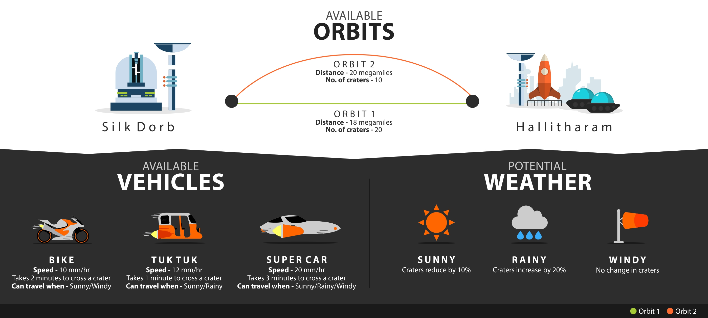

# **Mission Impossible**


### **Context**
<p>Our problem is set in the traffic snarls of planet Lengaburu. After the recent Falicornian war, victorious King
   Shan of Lengaburu wishes to tour his kingdom. But the traffic in Lengaburu is killing. You should see how Silk
   Dorb gets jammed in the evening!<BR><BR>
   Write code to help King Shan navigate Lengaburu's traffic.
   
### **Problem Statement**

<p>King Shan wants to visit the suburb of Hallitharam, and has 2 possible orbits and 3 possible vehicles to choose from.
   Your coding challenge is to determine which orbit and vehicle King Shan should take to reach Hallitharam the fastest.

#### **Travel Options**



### **Sample input & output**
<ul>
<li><B>Sample Input</B><br>
RAINY 40 25
<br>
</li>

<li>
<B>Sample Output</B><br>
CAR ORBIT2
</li>
</ul>

# Requirements
<ul>
<li>Java 1.8<br></li>
<li>Gradle 5.1<br></li>
</ul>

### **How to run the project**
Extract The Traffic.zip
```
cd Traffic
./gradlew clean build
```

To run any all the test case in Project
```
./gradlew test
```

After this go inside build/libs folder and run the following command:
<br>
```
java -jar geektrust.jar <absolute_path_to_input_file>
```

### **Authors**
Vaibhav Lodha
